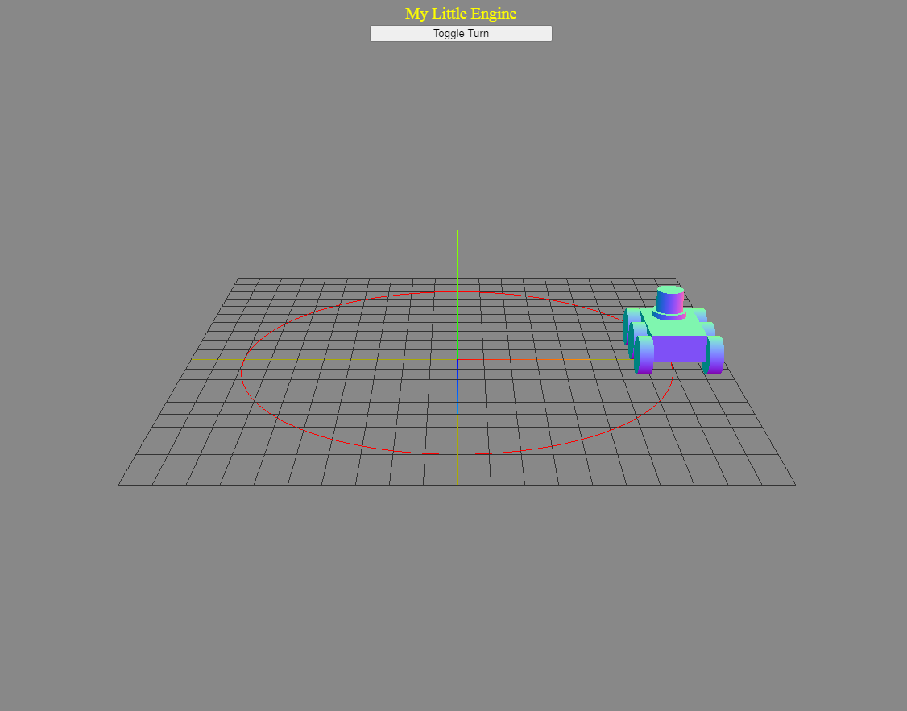

<!DOCTYPE html>

<html>

<head>

</head>

<body> 

GameProgrammingHW 
學號: E3B14 姓名: 林鈺凱 

	<table border="1" style="margin-left: auto; margin-right: auto;">
	<td width="33%"></td>
	   <tr align="center">
<tr align="center">
			<td><a href="0.html">0.html</a>   My Little Engine  </td>
</tr>
</table>

</body>

</html>
